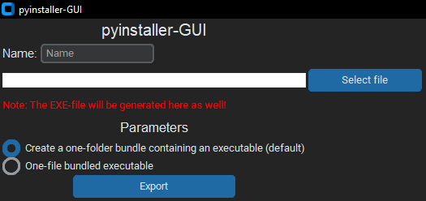

# pyinstaller-GUI-RECODE
> Developed by WafflesSoftware

# About
This is a GUI for the python module "pyinstaller" that helps you to use the module without commands! (Complete recode of the previous version, it isn't visible on my profile anymore though.)

# Images

# Features
* Finished
* Work in progress
* Planning

| Feature | State |
| -------- | -------- |
| Add an icon to the EXE | Work in progress |
| Parameters | Finished / Work in progress |
| Linux / macOS support | Planning |
| Custom export path | Work in progress |
| Custom file name | Finished |

# How to use
1. Check if you have all modules installed that you need. You can look in the "requirements.txt" file for that / install the modules directly from it.
2. Run the "main.py" file, after that everything will open. (Make sure you have all files in the same directory and didn't write anything in the "system" file.)
